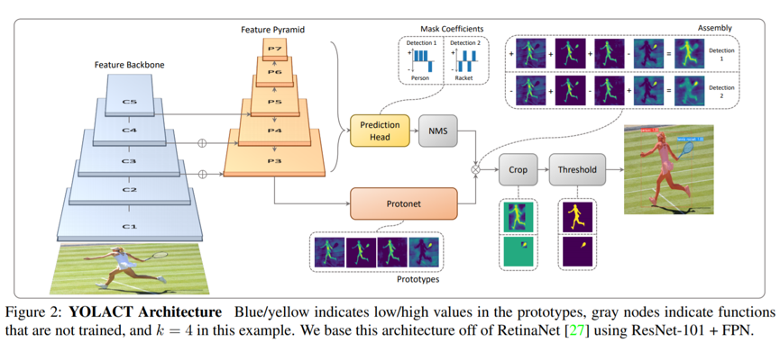

# YOLACT — Real-time Instance Segmentation (TensorFlow 2)

TensorFlow 2 implementation of [YOLACT: Real-time Instance Segmentation](https://arxiv.org/abs/1904.02689) (ICCV 2019).

You can **train from scratch** on COCO / Pascal SBD / a custom COCO-format dataset, then run **image / folder / video** inference. This repo does **not** ship pretrained detection weights — you retrain (or bring your own `.weights.h5`).

## Can I retrain myself?

**Yes.** The supported loop is:

1. Install deps  
2. Convert images + COCO-style JSON → TFRecords  
3. `python train.py ...` (ImageNet backbone weights download automatically)  
4. Use the saved `*.weights.h5` with `python eval.py ...`

You need a **GPU** for a realistic COCO/Pascal run (batch 8 at 550² typically wants ≥8–12 GB VRAM). CPU can smoke-test a few steps but is not practical for full training.

Verified stack (see `requirements.txt`): TensorFlow 2.15–2.20, NumPy 1.26.x, OpenCV 4.x.

---

## Quick start (retrain → infer)

```bash
git clone https://github.com/leohsuofnthu/Tensorflow-YOLACT.git
cd Tensorflow-YOLACT

python -m venv .venv
# Windows:  .venv\Scripts\activate
# Linux/macOS: source .venv/bin/activate
pip install -r requirements.txt

# --- after TFRecords exist under ./data/coco (see below) ---
python train.py --name coco --tfrecord_dir ./data --weights ./weights \
  --batch_size 8 --print_interval 10 --save_interval 5000

# Inference (use the file train.py wrote under ./weights/)
python eval.py --mode image --name coco \
  --image ./your.jpg \
  --weights ./weights/weights_coco_XX.XX.weights.h5 \
  --output_dir ./results
```

---

## 1. Install

```bash
pip install -r requirements.txt
python -m pytest test/test_e2e.py -v   # optional sanity check
```

First model build downloads **ImageNet** backbone weights (ResNet, etc.) — that is expected and separate from YOLACT detection weights.

---

## 2. Prepare TFRecords

`train.py` loads shards from:

```text
{tfrecord_dir}/{name}/train.record-xxxxx-of-xxxxx
{tfrecord_dir}/{name}/val.record-xxxxx-of-xxxxx
```

Example: `--name coco --tfrecord_dir ./data` → `./data/coco/train.record-*` and `./data/coco/val.record-*`.

### A. COCO 2017

1. Download [train2017](http://images.cocodataset.org/zips/train2017.zip), [val2017](http://images.cocodataset.org/zips/val2017.zip), [annotations](http://images.cocodataset.org/annotations/annotations_trainval2017.zip).
2. Layout (paths may vary; point the flags at your folders):

```text
data/train2017/          # images
data/val2017/
data/instances_train2017.json   # or data/annotations/instances_train2017.json
data/instances_val2017.json
```

3. Convert:

```bash
python -m data.coco_tfrecord_creator \
  --train_image_dir ./data/train2017 \
  --val_image_dir ./data/val2017 \
  --train_annotations_file ./data/instances_train2017.json \
  --val_annotations_file ./data/instances_val2017.json \
  --output_dir ./data/coco
```

This writes sharded files under `./data/coco/` (default 100 train / 50 val shards).

### B. Pascal SBD

Use [benchmark images](http://www.eecs.berkeley.edu/Research/Projects/CS/vision/grouping/semantic_contours/benchmark.tgz) and [COCO-style SBD JSON](https://drive.google.com/file/d/1ExrRSPVctHW8Nxrn0SofU1lVhK5Wn0_S/view) from the original YOLACT project. Split images into `pascal_train` / `pascal_val`, then:

```bash
python -m data.coco_tfrecord_creator \
  --train_image_dir ./data/pascal_train \
  --val_image_dir ./data/pascal_val \
  --train_annotations_file ./data/pascal_sbd_train.json \
  --val_annotations_file ./data/pascal_sbd_valid.json \
  --output_dir ./data/pascal
```

Train with `--name pascal`.

### C. Custom dataset

1. COCO-format JSON with `images`, `categories`, and `annotations` that include **`segmentation`** (polygon or RLE) and `bbox`.
2. Edit `config.py` **before** training:

| Key | What to set |
| --- | --- |
| `NUM_CLASSES['custom']` | **num classes + 1** (background). Required (`0` will error). |
| `YOUR_CUSTOM_CLASSES` | Class name tuple for drawing labels |
| `LABEL_MAP['custom']` | Only if category ids are not already contiguous `1..N` |
| `TRAIN_ITER` / `LR_STAGE['custom']` | Shorter schedule for small datasets |

3. Build TFRecords into a folder whose **basename matches** `--name`:

```bash
python -m data.coco_tfrecord_creator \
  --train_image_dir /path/to/train_images \
  --val_image_dir /path/to/val_images \
  --train_annotations_file /path/to/train.json \
  --val_annotations_file /path/to/val.json \
  --output_dir ./data/custom \
  --num_train_shards 10 \
  --num_val_shards 5
```

(Use fewer shards for small datasets; COCO defaults are 100 / 50.)

4. Train:

```bash
python train.py --name custom --tfrecord_dir ./data --weights ./weights --batch_size 4
```

---

## 3. Train

```bash
python train.py \
  --name coco \
  --tfrecord_dir ./data \
  --weights ./weights \
  --batch_size 8 \
  --momentum 0.9 \
  --weight_decay 0.0005 \
  --print_interval 10 \
  --save_interval 5000
```

| Flag | Meaning |
| --- | --- |
| `--name` | Dataset key in `config.py` and subdirectory under `--tfrecord_dir` |
| `--tfrecord_dir` | Parent of `{name}/` TFRecords |
| `--weights` | Directory for best mask-mAP `*.weights.h5` |
| `--batch_size` | Lower if OOM (try 2–4) |
| `--save_interval` | Steps between checkpoint + validation mAP |

**Outputs**

| Path | Contents |
| --- | --- |
| `./checkpoints/` | TF checkpoints (auto-resume on restart) |
| `./weights/weights_<name>_<mask_mAP>.weights.h5` | Best weights for `eval.py` (Keras 3 **requires** the `.weights.h5` suffix) |
| `./logs/gradient_tape/` | TensorBoard |

```bash
tensorboard --logdir ./logs
```

### Resume training

If `./checkpoints/` has a checkpoint, `train.py` restores it automatically and continues.

### Useful `config.py` knobs

| Parameter | Meaning |
| --- | --- |
| `BACKBONE` | `resnet50` (default), `resnet101`, `mobilenetv2`, `efficientNet-B0` |
| `IMG_SIZE` / `PROTO_OUTPUT_SIZE` | Default `550` / `138` |
| `NUM_MASK` | Prototypes `k` (default 32) |
| `TRAIN_ITER` / `LR_STAGE` | Iterations and LR drops per dataset |
| Detection thresholds | `CONF_THRESHOLD`, `NMS_THRESHOLD`, `TOP_K` |

Paper-style COCO schedule is long (`TRAIN_ITER['coco'] = 800000`). For experiments, lower `TRAIN_ITER` and `LR_STAGE` stages, or raise `--save_interval` so validation is less frequent.

---

## 4. Inference and evaluation

Always pass a real file ending in `.weights.h5` (or a `./checkpoints` directory).

```bash
# Validation mAP on TFRecords
python eval.py --mode val --name coco --tfrecord_dir ./data \
  --weights ./weights/weights_coco_XX.XX.weights.h5 --score_threshold 0.05

# Optional COCO-style JSON dump
python eval.py --mode val --name coco --tfrecord_dir ./data \
  --weights ./weights/weights_coco_XX.XX.weights.h5 --output_coco_json \
  --bbox_det_file ./results/bbox_detections.json \
  --mask_det_file ./results/mask_detections.json

# Single image
python eval.py --mode image --name coco --image ./demo.jpg \
  --weights ./weights/weights_coco_XX.XX.weights.h5 \
  --output_dir ./results --score_threshold 0.3

# Folder
python eval.py --mode images --name coco --image_dir ./demo_images \
  --weights ./weights/weights_coco_XX.XX.weights.h5 --output_dir ./results

# Video
python eval.py --mode video --name coco --video ./demo.mp4 \
  --weights ./weights/weights_coco_XX.XX.weights.h5 --output_dir ./results
```

Add `--display` for an OpenCV window (`q` quits on video/folder).

Without trained YOLACT weights, the CLI still runs but detections are meaningless (random heads).

---

## 5. Tests

```bash
python -m pytest test/test_e2e.py -v
```

Covers forward/detect shapes, `.weights.h5` roundtrip, synthetic-image inference helpers, and a synthetic loss step (no COCO download). Does **not** replace a real GPU training run on your data.

---

## Repository layout

| Path | Role |
| --- | --- |
| `yolact.py` | Model |
| `train.py` | Training |
| `eval.py` | Val mAP + image/video inference |
| `config.py` | Hyperparameters / per-dataset settings |
| `data/` | TFRecord creator, parser, anchors |
| `layers/` | FPN, ProtoNet, head, Fast NMS |
| `loss/` | Box / cls / mask / seg losses |
| `test/test_e2e.py` | End-to-end unit checks |

---

## Model (paper)

1. Prototype masks (ProtoNet on FPN `P3`)  
2. Per-instance mask coefficients (extra head)  
3. Assembly `M = σ(P Cᵀ)`, then box crop  

Plus Fast NMS and a **training-only** semantic segmentation loss.



### Intentional differences vs paper / original PyTorch

| Item | This repo | Paper / dbolya/yolact |
| --- | --- | --- |
| Default backbone | `resnet50` | ResNet-101 default |
| Input | Square `IMG_SIZE` (550) | Same for YOLACT-550 |
| Extra backbones | MobileNetV2, EfficientNet-B0 (experimental) | Not in original |
| Weight files | Keras 3 `*.weights.h5` | PyTorch `.pth` |
| YOLACT++ | Not implemented | Optional |

---

## Tips and common issues

| Problem | Fix |
| --- | --- |
| OOM during training | `--batch_size 2` or `4` |
| `NUM_CLASSES['custom'] must be >= 2` | Set classes **+ background** in `config.py` |
| Empty / missing TFRecords | `--output_dir` must be `{tfrecord_dir}/{name}`; check `train.record-*` exist |
| `filename must end in .weights.h5` | Use Keras 3 suffix when saving/loading |
| Bad / empty masks in custom data | Annotations need `segmentation`, not boxes only |
| `No such layer: conv3_block4_out` | Stick to `resnet50` / `resnet101` in this repo’s `config.py` |
| Numpy / OpenCV conflict | Keep `numpy<2` as in `requirements.txt` |

---

## Authors

- **HSU, CHIH-CHAO** — ML Master’s student at [Mila](https://mila.quebec/)

## References

- Paper: https://arxiv.org/abs/1904.02689  
- Original PyTorch: https://github.com/dbolya/yolact  
- RetinaNet TF parser ideas: TensorFlow Model Garden  
- SSD-TensorFlow augmentations: https://github.com/balancap/SSD-Tensorflow  
